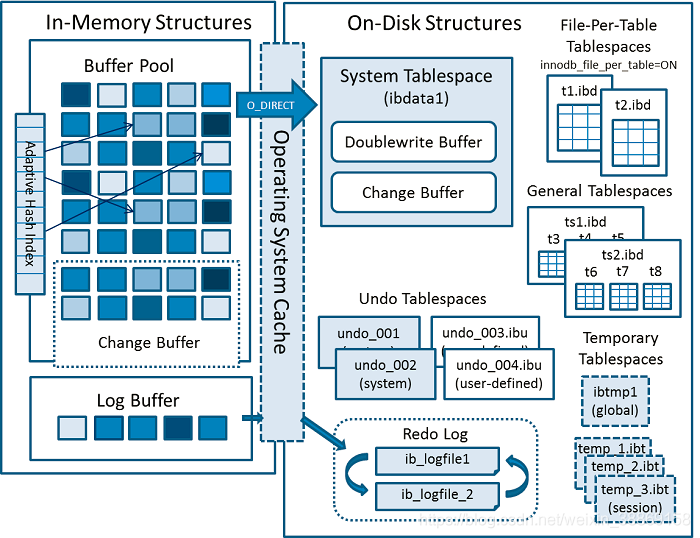

InnoDB存储引擎的逻辑架构
================

逻辑架构
---

**架构图**

**架构简述**

根据上图可知，InnoDB的逻辑架构主要分为三个大的组成部分：
* 在内存中的架构（In-Memory Structures）；
* 在硬盘上的架构（On-Disk Structures）；
* 操作系统缓存（Operating System Cache）。

下面将简要介绍每一个InnoDB的逻辑架构中的每一个组成部分。

内存中的架构
---

InnoDB的内存架构分为4个部分：
* 缓冲池（Buffer Pool)；
* 变更缓冲（Change Buffer）；
* 日志缓冲（Log Buffer）；
* 适应哈希索引（Adaptive Hash Index)；

**缓冲池(Buffer Pool)**

缓冲池是一块用于缓存被访问过的表和索引数据的内存区域，缓冲池允许在内存中处理一些被用户频繁访问的数据，在某一些专用的服务器上，甚至有可能使用80%的物理内存作为缓冲池。
缓冲池的存在主要是为了通过降低磁盘IO的次数来提升数据的访问性能。

**变更缓冲（Change Buffer）**

变更缓冲是为了缓存缓冲池（Buffer Pool）中不存在的二级索引(Secondary Index)页的变更操作的一种特殊的内存数据结构。
这些变更通常是一些Insert、Update、Delete等DML操作引发的，如果有一些其它的读操作将这些被变更的二级索引页加进了缓冲池（Buffer Pool)，则这些变更会被马上合并至缓冲池中以保证用户可以读取到一致的数据。

**日志缓冲(Log Buffer)**

主了提升访问性能，InnoDB将数据的每次写优化为了批量写，以降低磁盘IO的次数，那么日志缓冲就是用来缓存一些即将要被写入磁盘日志文件（log files)中的数据。

**自适应哈希索引(Adaptive Hash Index)**

在InnoDB中，用户是不可以直接去创建哈希索引的，这个自适应哈希索引是InnoDB为了加速查询性能，会根据实际需要来决定是否对于一些频繁需要被访问的索引页构建哈希索引，它会利用key的前缀来构建哈希索引。这样做可以提高查询性能，因为索引采用类似B+树的结构进行存储，B+树的单key查询时间复杂度为O(log2n)，但是优化为哈希索引后，单key的查询时间复杂度就为O(1)了。

磁盘上的架构
---

InnoDB在硬盘上总共分为六个部分，也就是：
* 表（Tables）；
* 表空间（Tablespaces）；
* 索引（Indexes）；
* 双写缓冲（Doublewrite Buffer）；
* 重做日志(Redo Log）；
* 回滚日志(Undo Log）。

**表（Tables）**

如果已经指定了数据的默认存储引擎，那么创建表的时候，无需指定再指定存储引擎。
默认情况下，创建InnoDB表的时候innodb_file_per_table参数是开启的，它表明用户创建的表和索引，会被以单表单文件的形式放入到file-per-table表空间中。如果禁用了该参数，那么表及索引会被放入系统表空间(System Tablespaces)中。如果创建表的时候，想要把表创建在通用表空间（General Tablespaces)中，那么需要用户使用CREATE TABLE … TABLESPACE语法来创建表结构。

**表空间（Tablespaces）**

在InnoDB中，表空间总共分为：
* 系统表空间（System Tablespaces）

系统表空间主要存储双写缓冲、写缓存以及用户创建的表和索引（当innodb_file_per_table被禁用的情况下）

* file-per-table表空间（file-per-tableTablespaces）

存储用户创建的表和索引数据，默认情况下（innodb_file_per_table参数是启用的）

* 通用表空间（General Tablespaces）

通用表空间允许用户存储一些自己想要放进通常表空间的表或数据，需要用户创建表的时候，自己指定采用通用表空间，上面讲表的时候已经介绍过。

* 回滚表空间（Undo Tablespaces）

回滚表空间是为了存储回滚日志，通常回滚日志在表空间会以回滚段(Undo Segments)的形式存在。

* 临时表空间（Temporary Tablespaces）

临时表空间用于存储用户创建的临时表，或者优化器内部自己创建的临时表。

**索引（Indexes）**

按键的类别划分：主键索引和二级索引；

按索引的类型分：BTree索引和自适应哈希索引；

按存储结构划分：聚集索引和非聚集索引。

索引存在的目的主要是为了加速数据的读取速度，InnoDB采用BTree（实际为优化改进后的B+树索引）。

主键索引也是聚集索引，二级索引都是非聚集索引。

自适应哈希索引是InnoDB为了加速查询性能，它自己按需在内存中对加载进内存的BTree索引优化为哈希索引的一种手段。

**双写缓冲（Doublewrite Buffer）**

双写缓冲是一个在系统表空间中存储区，在这个存储区中，在 InnoDB将页面写入InnoDB数据文件中的适当位置之前，会先从缓冲池中刷新页面 。如果在页面写入过程中发生操作系统，存储子系统或mysqld进程崩溃，则InnoDB可以在崩溃恢复期间从双写缓冲中找到页面的原来的数据。

**重做日志(Redo Log）**

重做日志是InnoDB在磁盘中将事务的写入行为和数据记录在redo log的日志文件中，它主要为了解决事务提交了之后，即使主机发生了宕机、或mysqlld进程崩溃等极端情况下的时候，重启完mysql服务之后，仍然可以保持已提交事务的数据一致性。

**回滚日志(Undo Log）**

回滚日志是InnoDB为了解决事务回滚后事务中已经发生的写入操作需要被失效而且要将数据回滚至提交前的一致性状态。这些回滚日志通常会被InnoDB存储于回滚表空间的日志文件中。前面说的重做日志，是为了保证ACID中的一致性要求中的要么都成功。那么这个回滚日志就是为了一致性要求的要么都失败。

操作系统缓存
---

对于操作系统来说，它也会有自己的缓存，为了提高操作系统的性能，虽然InnoDB进程发起了内核write()调用，但是操作系统也不一定会马上调用fsync()进行刷盘的操作。因为操作系统也同样会为了提升性能而降低磁盘IO的次数。
因此，在InnoDB的缓存体系与磁盘文件之间，还有一层操作系统的缓存。

参考文献
https://dev.mysql.com/doc/refman/8.0/en/

