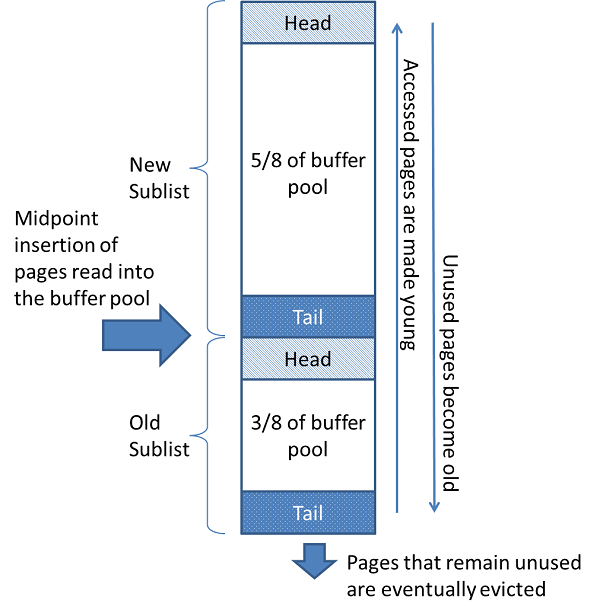

**一、缓冲池基本概念**

缓冲池是InnoDB用来缓存被访问过的表和索引数据的一块内存区域。为了提升处理速度，InnoDB允许在内存中对一些经常被使用的数据进行处理。在一些专用服务器上，可以将高达80%的物理内存分配给缓冲池。

为了让大量的读取操作更加有效，缓冲池会被切分为很多的数据页，而每一个数据页又可以容纳多行。为了让缓存管理更加有效，InnoDB采用了页链表的方式进行缓冲池的管理。采用了一个LRU算法的变种来将很少访问的数据从缓存中淘汰出去。

了解如何利用缓冲池将经常访问的数据保存在内存中是MySQL调优的一个重要方面。

**二、缓冲池LRU算法**

缓冲池是使用最近最少使用(LRU)算法的变体来对页链表来管理的。当需要空间向缓冲池中添加新页面时，将逐出最近最少使用的页面，并将一个新页面添加到列表的中间点。这种中间点插入策略其实就是将该页链表视为两个子链表：

- 在链表的头部，子链表中是一些新（&quot;年轻&quot;）的页，这些页面都是最近被访问的
- 在链表的尾部，子链表中是一些旧页，这些页面都是最近最少被访问的

缓存管理算法如下图所示：

该算法将经常使用的页面保存在新的子链表中。旧的子链表包含较少使用的页面，这些最近较少使用的页可能会被逐出：

默认情况下，算法如下进行操作：

(1) 3/8的缓冲池将被划拨给旧的子链表；

(2) 中间点就是新子链表的尾部和旧子链表头部的边界；

(3) 当InnoDB将一个页面读入缓冲池时，首先将它插入到中点(旧子链表的头)。这个页面可以被读取是因为它是用户发起的操作(如SQL查询)或InnoDB自动执行的预读操作的一部分所必需的。

(4) 访问旧子链表中的页面会使它变得年轻，并将其移动到新子链表的头部。如果页面是由于用户发起的操作需要而读取的，则会立即进行第一次访问，并使页面处于年轻状态。如果由于预读操作读取了该页，那么第一次访问不会立即发生使该页面年轻化的事情，而且可能在该页被逐出之前根本就一直不会发生。

(5) 在数据库操作时，缓冲池中未被访问的页面将移动到链表的尾部。不管是新的还是旧的子链表中的页面，在其它页面被标记为新页面的时候，都会对他们的年龄进行标记。当页面插入到中间点时，旧子链表中的页面也会变老。最终，一些驻留在旧链表尾部的未被访问的页会被逐出。

默认情况下，查询所读取的页面会立即移动到新的子链表中，这意味着它们在缓冲池中停留的时间更长。例如，对mysqldump操作或不带WHERE子句的SELECT语句执行的表扫描可以将大量数据带入缓冲池，并驱逐同等数量的旧数据，即使这些新数据永远不会再被使用。类似地，由预读后台线程加载且只访问一次的页面被移动到新链表的头部。这些情况可以将经常使用的页面推到旧的子链表中，在那里它们将被逐出。关于优化这个行为的信息，InnoDB提供了一些办法：

(1) 使缓冲池抵抗扫描；

(2) 配置InnoDB缓冲池预读。

关于这两种优化手段，下面我们在讲缓冲池的配置的时候，会再介绍一下。

**三、缓冲池的配置**

**3.1**  **配置缓冲池的大小**

理想情况下，您可以将缓冲池的大小设置为尽可能大的值，从而为服务器上的其他进程留下足够的内存，以便在不发生过度分页的情况下运行。缓冲池越大，InnoDB就越像一个内存中的数据库，从磁盘读取一次数据，然后在随后的读取过程中从内存中访问数据。理想情况下，您可以将缓冲池的大小设置为尽可能大的值，从而为服务器上的其他进程留下足够的内存，以便在不发生过度分页的情况下运行。缓冲池越大，InnoDB就越像一个内存中的数据库，从磁盘读取一次数据，然后在随后的读取过程中从内存中访问数据。

innodb_buffer_pool_size 缓冲池大小（单位：字节）

innodb_buffer_pool_chunk_size 缓冲池块大小（单位：字节）

缓冲池大小总是等于缓冲池块大小与缓冲池实例数的乘积：innodb_buffer_pool_size = innodb_buffer_pool_chunk_size * innodb_buffer_pool_instances.

假如你配置了innodb_buffer_pool_size，并且它不等于缓冲池块大小与缓冲池实例数的乘积，那么innodb_buffer_pool_size 的值会被自动调整为上述两值的乘积，也就是 innodb_buffer_pool_chunk_size * innodb_buffer_pool_instances 。

**3.2**  **配置多个缓冲池实例**

对于具有多个GB范围的缓冲池的系统，将缓冲池划分为单独的实例可以提高并发性，这可以减少不同线程读写缓存页面时的争用。该特性通常用于缓冲池大小在多个GB范围的系统。使用innodb_buffer_pool_instances配置选项配置多个缓冲池实例，还可以调整innodb_buffer_pool_size值。

当InnoDB缓冲池很大时，许多数据请求可以通过从内存中检索来满足。您可能会遇到多个线程同时访问缓冲池的瓶颈。您可以启用多个缓冲池来最小化这种争用。使用散列函数，将存储在缓冲池中或从缓冲池中读取的每个页面随机分配给其中一个缓冲池。每个缓冲池管理自己的空闲列表、刷新列表、LRUs和连接到缓冲池的所有其他数据结构。在MySQL 8.0之前，每个缓冲池都由它自己的缓冲池互斥来保护。在MySQL 8.0及以后版本中，缓冲池互斥被替换为几个保护互斥的列表和哈希，以减少争用。

要启用多个缓冲池实例，请将innodb_buffer_pool_instances配置选项设置为大于1(默认值)的值，最多为64(最大值)。这个选项只在将innodb_buffer_pool_size设置为1GB或1GB以上时生效。指定的总大小在所有缓冲池中划分。为了获得最佳效率，请指定innodb_buffer_pool_instances和innodb_buffer_pool_size的组合，以便每个缓冲池实例至少为1GB。

**3.3**  **使缓冲池抵御扫描**

InnoDB没有使用严格的LRU算法，而是使用了一种技术来最小化带入缓冲池并且再也不会被访问的数据量。其目标是确保经常访问(热)的页面保留在缓冲池中，即使预读和全表扫描带来了以后可能访问也可能不访问的新块。

新读取的块被插入到LRU列表的中间。所有新读取的页面都被插入到LRU列表尾部的3/8位置。在缓冲池中第一次访问这些页面时，它们会被移动到3/8列表的前面(也就是最近使用列表的末尾)。因此，从未被访问的页面永远不会到达LRU列表的前面5/8部分，并且比使用严格的LRU方法更快地老化。这种安排将LRU列表分为两个部分，其中插入点下游的页面被认为是旧的数据，是LRU逐出的理想受害者。

您可以控制LRU列表中的插入点，并选择InnoDB是否对通过表扫描或索引扫描进入缓冲池的块应用相同的优化。配置参数innodb_old_blocks_pct控制LRU列表中旧块的百分比。innodb_old_blocks_pct的默认值是37，对应于原来固定的比例3/8。值范围为5(缓冲池中的新页面很快就会过期)到95(缓冲池中只有5%为热页面保留，这使得算法接近我们熟悉的LRU策略)。

防止预读搅动缓冲池的优化可以避免由于表或索引扫描而导致的类似问题。在这些扫描中，数据页通常被快速连续地访问几次，并且再也不会被触及。配置参数innodb_old_blocks_time指定了第一次访问一个页面之后的时间窗口(以毫秒为单位)，在此期间可以访问该页面，而不需要移动到LRU链表的前端。innodb_old_blocks_time的默认值是1000。增加这个值可能会使越来越多的块从缓冲池中更快地老化。

innodb_old_blocks_pct和innodb_old_blocks_time都可以在MySQL选项文件(my.cnf或my.ini)中指定，也可以在运行时用SET GLOBAL语句更改。在运行时更改值需要足够的权限来设置全局系统变量。

为了帮助您评估设置这些参数的效果，SHOW ENGINE INNODB STATUS命令会报告缓冲池统计信息。

由于这些参数的效果可能根据硬件配置、数据和工作负载的细节而有很大差异，所以在任何性能关键型环境或生产环境中，在更改这些设置之前，总是要进行基准测试，以验证其有效性。

在大多数活动是OLTP类型的混合工作负载中，定期的批处理报告查询会导致大扫描，在批处理运行期间设置innodb_old_blocks_time的值可以帮助将正常工作负载的工作集保持在缓冲池中。

当扫描无法完全装入缓冲池的大表时，将innodb_old_blocks_pct设置为一个小值可以防止只读取一次的数据占用缓冲池的很大一部分。例如，设置innodb_old_blocks_pct=5将只读取一次的数据限制为缓冲池的5%。

当扫描能够装入内存的小表时，在缓冲池中移动页面的开销更小，因此可以让innodb_old_blocks_pct保持默认值，甚至更高，比如innodb_old_blocks_pct=50。

innodb_old_blocks_time参数的影响比innodb_old_blocks_pct参数更难预测，它的影响相对较小，并且随着工作负载的变化更大。

为了得到最优值，如果调整innodb_old_blocks_pct的性能改进还不够，您可以自己进行基准测试。

**3.4**  **配置缓冲池预读**

预读请求是一个I/O请求，用于异步预取缓冲池中的多个页面，以预期这些页面将很快被需要。请求在一个区段中引入所有页面。InnoDB使用了两种预读算法来提高I/O性能:

(1) 线性预读

线性预读是一种基于缓冲池中被顺序访问的页面来预测即将需要哪些页面的技术。通过使用配置参数innodb_read_ahead_threshold来调整触发异步读取请求所需的顺序页面访问次数，可以控制InnoDB何时执行预读操作。在添加这个参数之前，InnoDB只会在读取当前区段的最后一页时计算是否要对整个下一个区段发出异步预取请求。

配置参数innodb_read_ahead_threshold控制着InnoDB检测顺序页面访问模式的敏感度。如果从一个区段连续读取的页面数大于或等于innodb_read_ahead_threshold, InnoDB会对整个后续区段启动一个异步预读操作。innodb_read_ahead_threshold可以设置为0-64之间的任何值。默认值是56。值越高，访问模式检查越严格。例如，如果你将这个值设置为48,InnoDB只会在48个页面被顺序访问的情况下触发一个线性提前读取请求。如果值是8, InnoDB会触发异步提前读取，即使只有8个页面被顺序访问。您可以在MySQL配置文件中设置该参数的值，或者使用SET GLOBAL语句动态地更改它，这需要足够的权限来设置全局系统变量。

(2) 随机预读

随机预读是一种技术，它根据缓冲池中已经存在的页面预测何时可能需要这些页面，而不考虑这些页面被读取的顺序。如果在缓冲池中发现来自相同区段的13个连续的页面，InnoDB异步地发出请求来预取区段的剩余页面。要启用这个特性，请将配置变量innodb_random_read_ahead设置为ON。

显示引擎INNODB状态命令显示统计信息，帮助您评估预读算法的有效性。统计信息包括以下全局状态变量的计数器信息:

Innodb_buffer_pool_read_ahead

Innodb_buffer_pool_read_ahead_evicted

Innodb_buffer_pool_read_ahead_rnd

**3.5**  **配置缓冲池刷新**

InnoDB在后台执行某些任务，包括刷新缓冲池中的脏页面。脏页是那些已经被修改但还没有写到磁盘上的数据文件的页面。

在MySQL 8.0中，缓冲池刷新是由页面清理线程执行的。页面清理线程的数量由innodb_page_cleaners变量控制，该变量的默认值为4。但是，如果页面清理线程的数量超过了缓冲池实例的数量，则会自动将innodb_page_cleaners设置为与innodb_buffer_pool_instances相同的值。

当脏页的百分比达到innodb_max_dirty_pages_pct_lwm变量定义的低水标记值时，启动缓冲池刷新。默认的低水位标记是缓冲池页面的10%。innodb_max_dirty_pages_pct_lwm值为0将禁止这种早期刷新行为。

innodb_max_dirty_pages_pct_lwm阈值的目的是控制缓冲池中脏页面的百分比，并防止脏页面的数量达到innodb_max_dirty_pages_pct变量定义的阈值，该变量的默认值为90。如果缓冲池中脏页面的百分比达到了innodb_max_dirty_pages_pct阈值，InnoDB会主动刷新缓冲池页面。

其他变量允许对缓冲池刷新行为进行微调:

- innodb_flush_neighbors变量定义从缓冲池刷新一个页面是否也会以相同的程度刷新其他脏页面。

(1) 默认设置为0将禁用innodb_flush_neighbors。不刷新相同范围内的脏页。对于寻道时间不是重要因素的非旋转存储(SSD)设备，建议进行此设置。

(2) 设置为1可以在相同的范围内刷新连续的脏页面。

(3) 设置为2可以在相同程度上刷新脏页面。

当表数据存储在传统的HDD存储设备上时，与在不同时间刷新单个页面相比，在一次操作中刷新相邻页面可以减少I/O开销(主要用于磁盘查找操作)。对于存储在SSD上的表数据，寻道时间不是一个重要因素，您可以禁用此设置以展开写操作。

- innodb_lru_scan_depth变量指定每个缓冲池实例，在缓冲池LRU中列出页面清理器线程扫描要刷新的脏页面的位置。这是由页面清理线程每秒执行一次的后台操作。

小于默认值的设置通常适用于大多数工作负载。明显高于必要值的值可能会影响性能。只有在典型工作负载下有空闲I/O容量时才考虑增加这个值。相反，如果写密集型工作负载使您的I/O容量饱和，则减少这个值，特别是在大型缓冲池的情况下。

在调优innodb_lru_scan_depth时，从一个较低的值开始，然后向上配置设置，目标是很少看到空闲页面。另外，在更改缓冲池实例数量时，可以考虑调整innodb_lru_scan_depth，因为innodb_lru_scan_depth \* innodb_buffer_pool_instances定义了页面清理线程每秒执行的工作量。

innodb_flush_neighbors和innodb_lru_scan_depth变量主要用于写密集型工作负载。对于大量的DML活动，如果刷新不够主动，则刷新可能会延迟;如果刷新太主动，则磁盘写可能会使I/O容量饱和。理想的设置取决于工作负载、数据访问模式和存储配置(例如，数据存储在HDD或SSD设备上)。

**3.5.1**  **自适应刷新**

InnoDB使用自适应刷新算法，根据Redo Log生成速度和当前刷新速度动态调整刷新速度。其目的是通过确保刷新活动与当前工作负载保持同步来平滑总体性能。自动调整刷新速率有助于避免吞吐量突然下降，当缓冲池刷新导致的I/O活动爆发影响普通读写活动可用的I/O容量时，可能会出现这种情况。

例如，sharp检查点通常与生成大量重做条目的写密集型工作负载相关联，可能导致吞吐量的突然变化。当InnoDB想要重用日志文件的一部分时，就会出现一个sharp检查点。在这样做之前，必须刷新日志文件的该部分中所有包含Redo条目的脏页面。如果日志文件满了，就会出现一个明显的检查点，导致吞吐量暂时减少。即使没有达到innodb_max_dirty_pages_pct阈值，也会出现这种情况。

自适应刷新算法通过跟踪缓冲池中的脏页数量和生成重做日志记录的速度，帮助避免此类场景。根据这些信息，它决定每秒从缓冲池中刷新多少脏页，这允许它管理工作负载中的突然变化。

innodb_adaptive_flushing_lwm变量为重做日志容量定义了一个低水位标记。当越过这个阈值时，即使禁用了innodb_adaptive_flushing变量，也会启用自适应刷新。

内部基准测试表明，该算法不仅可以随着时间的推移保持吞吐量，而且还可以显著提高总体吞吐量。但是，自适应刷新可以显著影响工作负载的I/O模式，并可能不适用于所有情况。当重做日志有被填满的危险时，它提供了最大的好处。如果自适应刷新不适合您的工作负载的特征，您可以禁用它。自适应刷新由innodb_adaptive_flushing变量控制，这个变量在默认情况下是启用的。

innodb_flushing_avg_loops定义了InnoDB保存之前计算的刷新状态快照的迭代次数，控制自适应刷新对前台工作负载变化的响应速度。较高的innodb_flushing_avg_loops值意味着InnoDB保持之前计算的快照的时间更长，因此自适应刷新的响应更慢。在设置较高的值时，一定要确保重做日志利用率不达到75%(启动异步刷新的硬编码限制)，并且innodb_max_dirty_pages_pct阈值将脏页面的数量保持在适合工作负载的水平。

具有一致的工作负载、较大的日志文件大小(innodb_log_file_size)以及日志空间利用率未达到75%的小峰值的系统应该使用较高的innodb_flushing_avg_loops值来尽可能平滑地刷新。对于具有极端负载高峰的系统或日志文件不提供大量空间的系统，较小的值允许刷新以密切跟踪工作负载变化，并有助于避免达到75%的日志空间利用率。

请注意，如果刷新速度落后，缓冲池刷新的速度可能会超过InnoDB可用的I/O容量，这是由innodb_io_capacity设置定义的。innodb_io_capacity_max值定义了这种情况下I/O容量的上限，这样I/O活动中的峰值不会消耗服务器的整个I/O容量。

innodb_io_capacity设置适用于所有缓冲池实例。当刷新脏页时，在缓冲池实例之间平均分配I/O容量。

**3.5.2**  **空闲周期内限制缓冲区刷新**

从MySQL 8.0.18开始，您可以使用innodb_idle_flush_pct变量来限制空闲期间缓冲池的刷新速度，空闲期间是数据库页面未被修改的时间段。innodb_idle_flush_pct值是innodb_io_capacity设置的百分比，该设置定义了InnoDB每秒可用的I/O操作数。默认的innodb_idle_flush_pct值是100，它是innodb_io_capacity设置的100%。

要限制空闲期间的刷新，请定义innodb_idle_flush_pct值小于100。在空闲时间限制页面刷新可以帮助延长固态存储设备的寿命。在空闲期间限制页面刷新的副作用可能包括长空闲时间之后的更长的关闭时间，以及发生服务器故障时的更长的恢复时间。

**3.6**  **保存与恢复缓冲池状态**

为了减少重启服务器后的预热时间，InnoDB在服务器关闭时为每个缓冲池保存一定百分比的最近使用的页面，并在服务器启动时恢复这些页面。存储的最近使用页面的百分比是由innodb_buffer_pool_dump_pct配置选项定义的。

在重新启动繁忙的服务器之后，通常会有一个逐渐增加吞吐量的预热期，因为缓冲池中的磁盘页会被带回内存中(因为要查询、更新相同的数据，等等)。在启动时恢复缓冲池的能力缩短了预热时间，因为在重启之前重新加载缓冲池中的磁盘页，而不是等待DML操作访问相应的行。另外，可以批量执行I/O请求，从而使总体I/O速度更快。页面加载在后台进行，不会延迟数据库启动。

除了在关闭时保存缓冲池状态并在启动时恢复它之外，您还可以在服务器运行时随时保存和恢复缓冲池状态。例如，在稳定的工作负载下达到稳定的吞吐量之后，可以保存缓冲池的状态。您还可以在运行报告或维护作业(这些作业将数据页带入仅为这些操作请求的缓冲池)之后，或在运行一些其他非典型工作负载之后，恢复以前的缓冲池状态。

尽管缓冲池的大小可以有很多个GB，但InnoDB保存到磁盘的缓冲池数据相对来说很小。只有查找适当页所需的表空间id和页id被保存到磁盘。该信息来自于INNODB_BUFFER_PAGE_LRU INFORMATION_SCHEMA表。默认情况下，表空间ID和页面ID数据保存在一个名为ib_buffer_pool的文件中，该文件被保存到InnoDB数据目录中。可以使用innodb_buffer_pool_filename配置参数修改文件名和位置。

由于数据在缓冲池中缓存并在缓冲池中老化，就像常规数据库操作一样，所以如果磁盘页面是最近更新的，或者DML操作涉及到尚未加载的数据，也没有问题。加载机制跳过不再存在的请求页面。

底层机制涉及一个被分派来执行转储和加载操作的后台线程。

压缩表中的磁盘页以压缩的形式加载到缓冲池中。当在DML操作期间访问页面内容时，像往常一样对页面进行解压缩。由于解压缩页面是一个cpu密集型的过程，因此在连接线程中执行操作比在执行缓冲池恢复操作的单个线程中执行操作更有效。

**四、**** InnoDB ****缓冲池标准监控**

InnoDB标准监控输出，可以使用[SHOW ENGINE INNODB STATUS](https://dev.mysql.com/doc/refman/8.0/en/innodb-standard-monitor.html)
命令来访问，它提供了关于缓冲池操作的各项指标。缓冲池指标位于InnoDB标准监控输出的缓冲池和内存部分，类似于下面所示为InnoDB标准监控输出：

----------------------

BUFFER POOL AND MEMORY

----------------------

Total large memory allocated 2198863872

Dictionary memory allocated 776332

Buffer pool size   131072

Free buffers       124908

Database pages     5720

Old database pages 2071

Modified db pages  910

Pending reads 0

Pending writes: LRU 0, flush list 0, single page 0

Pages made young 4, not young 0

0.10 youngs/s, 0.00 non-youngs/s

Pages read 197, created 5523, written 5060

0.00 reads/s, 190.89 creates/s, 244.94 writes/s

Buffer pool hit rate 1000 / 1000, young-making rate 0 / 1000 not

0 / 1000

Pages read ahead 0.00/s, evicted without access 0.00/s, Random read

ahead 0.00/s

LRU len: 5720, unzip_LRU len: 0

I/O sum[0]:cur[0], unzip sum[0]:cur[0]

下面是各项缓冲池指标的表格清单：

| 名称 | 描述 |
| --- | --- |
| Total memory allocated | 分配给缓冲池的总内存（单位：字节） |
| Dictionary memory allocated | 分配给InnoDB数据字典的总内存（单位：字节） |
| Buffer pool size | 分配给缓冲池的最大页数 |
| Free buffers | 缓冲池空闲链表上的总页数 |
| Database pages | 分配给缓冲池LRU链表的总页数 |
| Old database pages | 分配给缓冲池LRU链表中旧子链表的总页数 |
| Modified db pages | 缓冲池中到目前为止被更新的总页数 |
| Pending reads | 即将被读入缓冲池的总页数 |
| Pending writes LRU | LRU链表底部等待被写入的旧的脏页数 |
| Pending writes flush list | 检查点之间即将被刷盘的总页数 |
| Pending writes single page | 缓冲池中每个页上的写等待总次数的总和（有些页上可能同时出现多个写等待） |
| Pages made young | 从旧子链表上移动到新子链表的总页数 |
| Pages made not young | 旧子链表中未移动到新子列表的总页数 |
| youngs/s | 旧子链表中每秒被访问从而被加入新子链表（make young）的页数 |
| non-youngs/s | 旧子链表中每秒被访问但并未加入新子链表的页数 |
| Pages read | 缓冲池中被访问的总页数 |
| Pages created | 缓冲池中被创建的总页数 |
| Pages written | 缓冲池中被写的总页数 |
| reads/s | 缓冲池中每秒平均读页次数 |
| creates/s | 缓冲池中每秒平均创建页次数（体现物理IO压力） |
| writes/s | 缓冲池中每秒平均创建页次数（体现物理IO压力） |
| Buffer pool hit rate | 缓冲池命中率（判断缓冲池大小设置是否充足） |
| young-making rate | 旧子链表中的页访问导致make young的命中率 |
| not (young-making rate) | 旧子链表中的页访问未导致make young的命中率 |
| Pages read ahead | 平均每秒预读的页数 |
| Pages evicted without access | 平均每秒被逐出的页数 |
| Random read ahead | 平均每秒随机预读页数 |
| LRU len | LRU链表的总页数 |
| unzip_LRU len | 压缩页LRU链表上的页数 |
| I/O sum | 过去50s内，LRU链表上的每个页被访问的次数总和 |
| I/O cur | 过去50s内，LRU链表被访问的总次数（每次可访问多个页） |
| I/O unzip sum | 过去50s内，压缩页LRU链表上的每个页被访问的次数总和 |
| I/O unzip cur | 过去50s内，压缩页LRU链表被访问的总次数 |

**参考文献**

[https://dev.mysql.com/doc/refman/8.0/en/innodb-buffer-pool.html](https://dev.mysql.com/doc/refman/8.0/en/innodb-buffer-pool.html)