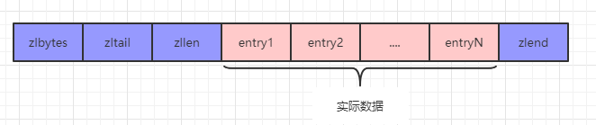
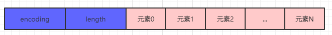

**一、数据类型概述**

大家都知道，Redis能够支持的基本数据类型有：String, List, Hash, Set, SortedSet这五种。那么这些底层的数据结构都是什么样的呢，为了支持上面的这5种基本数据类型，redis底层采用了简单动态字符串、双向链表、压缩列表、字典、跳表、整数集合这6种数据结构来达到目标。

下面，我们给出这些数据类型之间的映射关系，如下图所示：

**二、简单动态字符串-sds**

我们先看看Redis中sds结构体的源码，如下：

struct __attribute__ ((__packed__)) sdshdr5 {

unsigned char flags; _/*_ _低 __3__ 位存储类型 __,_ _高__ 5__位存储长度_ _*/    _

char buf[]; /*柔性数组，存放实际数据*/

};

struct __attribute__ ((__packed__)) sdshdr8 {

uint8_t len; _/* 1__个字节存储已使用长度_ _*/    _

uint8_t alloc; _/* 1__个字节存储已分配长度_ _*/    _

unsigned char flags; _/*_ _低 __3__ 位存储类型 __,_ _高__ 5__位预留_ _*/    _

char buf[]; /*柔性数组，存放实际数据*/

};

struct __attribute__ ((__packed__)) sdshdr16 {

uint16_t len; _/* 2__个字节存储已使用长度_ _*/    _

uint16_t alloc; _/* 2__个字节存储已分配长度_ _*/    _

unsigned char flags; _/*_ _低 __3__ 位存储类型 __,_ _高__ 5__位预留_ _*/    _

char buf[]; /*柔性数组，存放实际数据*/

};

struct __attribute__ ((__packed__)) sdshdr32 {

uint32_t len; _/* 4__个字节存储已使用长度_ _*/    _

uint32_t alloc; _/* 4__个字节存储已分配长度_ _*/    _

unsigned char flags; _/*_ _低 __3__ 位存储类型 __,_ _高__ 5__位预留_ _*/    _

char buf[]; /*柔性数组，存放实际数据*/

};

struct __attribute__ ((__packed__)) sdshdr64 {

uint64_t len; _/* 8__个字节存储已使用长度_ _*/    _

uint64_t alloc; _/* 8__个字节存储已分配长度_ _*/    _

unsigned char flags; _/*_ _低 __3__ 位存储类型 __,_ _高__ 5__位预留_ _*/    _

char buf[]; /*柔性数组，存放实际数据*/

};

sdshdr5和sdshdr8、sdshdr16、sdshdr32、sdshdr64不太一样，它是专门用来存储长度小于32的字符串类型的key的，不会用于存储value，可能redis设计得觉得key不太需要变化，而sdshdr5只有1个字节的8位中的5位来表示长度，因此这个结构体并不具备扩容的潜力。

sdshdr8、sdshdr16、sdshdr32、sdshdr64这4种结构体，除了表示长度的数据类型不一样，其它的都一样。之所以设计成这4种结构体，主要是为了节省内存。redis会根据要保存的字符串的长度，选用不同的sds结构体类型来存储。

比如说，我们采用sdshdr8存储了&quot;abcde&quot;这样的字符串，如下图所示：

采用sds而非原生的C字符串，主要是为了以下好处：

(1)、以空间换时间，通过预分配内存的方式，来降低字符串变化时，频繁的内存申请开销；

(2)、sds对象中的bug是一个柔性数组，有上层调用的时候，直接只返回了buf。由于buf是直接指向内容的指针，故而它可以兼容C语言字符串的函数。另外，它通过len限制读取的长度，这样可以避免读到&#39;\0&#39;字符，从而可以保证字符串读取的二进制安全。

(3)、如果采用原生的C字符串存储，那么获取字符串长度的时间复杂度就是O(n)，但采用sds的话，获取字符串长度的时间复杂度就是O(1)。

**三、双向链表-quicklist**

我们先看看这个双向链表的结点类型的结构体的源码：

typedef struct quicklistNode {

struct quicklistNode *prev; /* 前驱指针 */

struct quicklistNode *next; /* 后继指针 */

unsigned char *zl; /* 指向该节点对应的ziplist结构体的指针 */

unsigned int sz;             _/*_ _当前节点对应的 __ziplist__ 的字节数_ _*/    _

unsigned int count : 16;     _/*_ _当前节点对应的 __ziplist__ 的元素个数_ _*/  _

unsigned int encoding : 2;   _/* RAW==1 __代表采用原生编码 或_ _LZF==2__ 代表采用 __LZF__ 进行压缩_ _*/    _

unsigned int container : 2;  _/* NONE==1 __代表不需要容器存储 或_ _ZIPLIST==2__ 代表采用 __ziplist__ 存储_ _*/    _

unsigned int recompress : 1; _/*_ _当前节点的前驱是否被压缩_ _*/    _

unsigned int attempted_compress : 1; _/*_ _测试时使用：数据很小，不需要压缩_ _*/    _

unsigned int extra : 10; _/*_ _预留字段_ _*/_

} quicklistNode;

下面我们给出双向链表在内存中的结构示意图：

双向链表这种结构，是专门为存储List类型而设计的，这里有两个问题：

问题1：为什么采用双向链表而非单链表来进行存储？

因为双向链表有一个好处就是可以逆序遍历，可以满足我们对List进行逆序操作的需求。

问题2：在第一节中，我们了解到，List还有可能采用压缩列表来进行存储，而并非所有的List都采用双向链表来进行存储呢？

这是因为当List里的元素个数比较较少且每个元素的数据也比较小的时候，采用压缩列表来进行可以节省存储空间。

双向链表常见操作时间复杂度：

查找、删除：O(n)

插入（头插和尾插）：O(1)

在指定元素后插入：O(n)

**四、压缩列表-ziplist**

Redis为了节省空间，采用字节数组的方式来实现压缩链表，其存储结构如下：

zlbytes：表示整个压缩列表可以存储的最大字节数，4个字节，最多存储232-1个字节；

ztail：zlend相对起始位置的相对偏移量，4个字节。

zllen：压缩列表的元素个数，2个字节，最多只能支持216-1，也就是65536个元素，如果压缩列表中元素的个数超过了这个数值，那么要获取压缩列表的长度，必须遍历整个压缩列表，因此，采用压缩列表存储的时候，元素个数通常比较小。要不然，获取列表长度的时间复杂度将由O(1)直接攀升至O(n)。

zlend：占1个字节，恒定存储0xFF。

entry：实际数据中的条目，可以是字节数组，也可以是整数，长度没有限制，插入之前都会先进行压缩再存储，查询的时候，也会进行解压缩。

Redis通过压缩列表来存储数据，它就有如下的特点：

(1)、不适合存在大量的元素，因为存在元素多了之后，如果有数据插入、删除，那么将会涉及到整个字节数组的移动，会降低性能；

(2)、但是这种存储方式非常节省空间，无论存在多少数据，元数据所占用的空间都只有：4+4+2+1，仅仅只有11个字节的元数据存储开销。这一点跟sds不太一样，sds非常浪费存储空间的原因就在于每一个字符串，都有自己的元数据要浪费存储空间。这一点，我们在使用redis的时候需要格外的注意。

压缩列表获取长度的时间复杂度：O(1)

压缩列表插入、查询与删除的时间复杂度均为O(n)

**五、字典-dict**

Redis关于字典的实现，底层也是用的哈希表，我们先回顾一下哈希表的结构：

哈希表其实就是一个数组，每一个key计算完哈希后，会命中数组中的一个位置，如果数组中已经存在该key，这就是哈希冲突，Redis解决哈希冲突采取的是常见的&quot;拉链法&quot;，也就是在数组的元素中拉出一个链表来。

下面，我们再看看Redis关于哈希表的源码：

/* 哈希表结构体 */

typedef struct dictht {

    dictEntry **table; /* 指向数组的指针 */

    unsigned long size; /* table数组的容量 */

    unsigned long sizemask; /* 掩码用于快速计算key的哈希值位于哪个位置，按位与运算性能高于求模 */

    unsigned long used; /* table数组中已经存在的元素个数 */

} dictht;

/* 字典条目结构体 */

typedef struct dictEntry {

      void *key; /* 键 */

    union {

      void *val;

      uint64_t u64;

      int64_t s64;

      double d;

    } v; /* 值及过期时间 */

    struct dictEntry *next; /* 哈希冲突时指向下一个冲突的元素，形成链表 */

} dictEntry;

哈希表插入、查询也删除的时间复杂度都是O(1)

**六、跳表-zskiplist**

我们先看看Redis关于跳表的定义代码：

/* 跳表结构体 */

typedef struct zskiplist {

    struct zskiplistNode *header, *tail; /* 分别定义头尾指针*/

    unsigned long length; /* 除头节点外的节点总数 */

    int level; /* 跳表的高度 */

} zskiplist;

/* 跳表节点类结构体 */

typedef struct zskiplistNode {

      sds ele; /* 用于存储字符串类的数据 */

    double score; /* 用于存储排序的分值 */

    struct zskiplistNode *backward; /* 后退指针 */

    struct zskiplistLevel {

      struct zskiplistNode *forward; /* 前进指针 */

      unsigned long span; /* 间距：forward指向的节点与当前节点之间的元素个数 */

    } level[]; /* 柔性数组，用于存储一个或多个前进指针 */

} zskiplistNode;

根据redis中关于跳表结构的定义，我们大致可以绘出下面的跳表结构图，如下：

redis中跳表的实现，除了有前进指针之外，还提供了后退指针，后退指针的作用：比如说我们在Sorted Set里保存数据的时候，数据按升序进行存储，但是我们可以取TOP N条之类的降序范围查询。

跳表的查询、查找及删除的时间复杂度都是：O(logn)

另外，跳表支持正序以及逆序的范围查询，这也就是为什么Redis使用跳表而不使用红黑树的原因所在，尽管跳表在维护自平衡时所要付出的代价要大于红黑树，但跳表的优势就是支持范围查询。

**七、整数集合-intset**

redis还提供了一个整数集合的基础数据结构，源码如下：

/* 整数集合结构体 */

typedef struct intset {

uint32_t encoding; /* 编码类型 */

uint32_t length; /* 元素个数 */

int8_t contents[]; /* 柔性数组，根据encoding的类型决定几个字节存储一个元素 */

} intset;

其内存结构如下：

encoding：占4个字节，表示编码类型

length：占4个字节，表示元素个数

每一个元素的长度由encoding决定，encoding的选项有：

INTSET_ENC_INT16：2个字节

INTSET_ENC_INT32：4个字节

INTSET_ENC_INT64：8个字节

整数集合的底层用于存储具体数据的，其实就是一个整数数组。

整数集合一些常见操作的时间复杂度：

插入、删除：O(n)

查找：O(logn)

获取元素个数及随机查找：O(1)